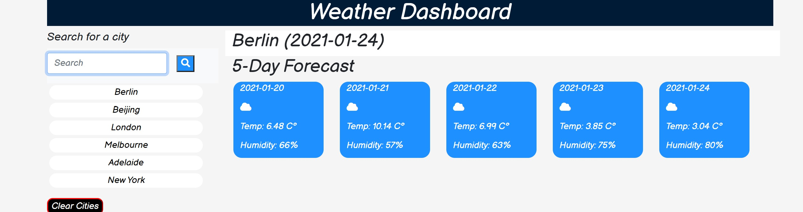

# 06-server-side-apis
# w5-hw-assignment

## Motivation 
This product utilises the jQuery method ajax to use a weather API that describes the weather of any city in the world. By grabbing the key information and displaying it to the webpage, users are able to find the current temperature, humidity, wind speed and uv index for the current day as well as temperature, whether it is snowing, raning, clear or cloudy and the humidity for the following five days. 

## Installation
- Use bootstrap to incorporate some visual implementation
- Add classes and html elements for javascript items to append in to
- Searches are saved in buttons and local storage for user to return to 
- Weather function using ajax method to get api links
- Find current weather and relevant information and append to the webpage
- Find UV index api and append uv Index to page with styling based on severity
- Find future information and append to webpage
- Call function to run when stored buttons are clicked or when a search is executed

## Usage

TThe above image shows what is dispalyed when the user searches for a city or clicks a button they have already searched for. The current weather is displayed and the 5 day forecast is too. 

## Credits
https://getbootstrap.com/
https://fonts.google.com/
https://fontawesome.com/
[OpenWeather API](https://openweathermap.org/api) 

## Licnece 
MIT License

Copyright (c) [2020] [Ben Cyna]

Permission is hereby granted, free of charge, to any person obtaining a copy
of this software and associated documentation files (the "Software"), to deal
in the Software without restriction, including without limitation the rights
to use, copy, modify, merge, publish, distribute, sublicense, and/or sell
copies of the Software, and to permit persons to whom the Software is
furnished to do so, subject to the following conditions:

The above copyright notice and this permission notice shall be included in all
copies or substantial portions of the Software.

THE SOFTWARE IS PROVIDED "AS IS", WITHOUT WARRANTY OF ANY KIND, EXPRESS OR
IMPLIED, INCLUDING BUT NOT LIMITED TO THE WARRANTIES OF MERCHANTABILITY,
FITNESS FOR A PARTICULAR PURPOSE AND NONINFRINGEMENT. IN NO EVENT SHALL THE
AUTHORS OR COPYRIGHT HOLDERS BE LIABLE FOR ANY CLAIM, DAMAGES OR OTHER
LIABILITY, WHETHER IN AN ACTION OF CONTRACT, TORT OR OTHERWISE, ARISING FROM,
OUT OF OR IN CONNECTION WITH THE SOFTWARE OR THE USE OR OTHER DEALINGS IN THE
SOFTWARE.

## working product 
https://bencyna.github.io/06-server-side-apis/