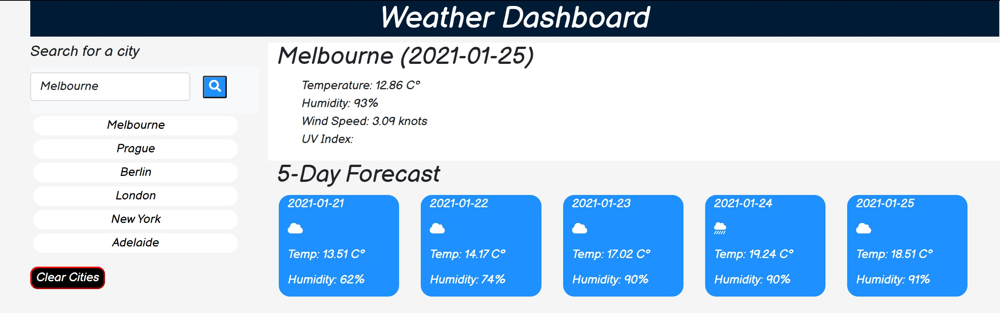

# Weather Dashboard

   
    
   ## Description
   This product utilises the jQuery method ajax to use a weather API that describes the weather of any city in the world. By grabbing the key information and displaying it to the webpage, users are able to find the current temperature, humidity, wind speed and uv index for the current day as well as temperature, whether it is snowing, raning, clear or cloudy and the humidity for the following five days.     
  
   ## Table Of Contents
   * [Installation](##Installation)
   * [Usage](##Usage)
   * [License](##License)
   * [Contributing](##Contributing)
   * [Tests](##Tests)
   * [Questions](##Questions)
  
   ## Installation
   Use of bootstrap to incorporate some visual implementation. Added classes and html elements for javascript items to append in to. Searches are saved in buttons and local storage for user to return to. Weather function using ajax method to get api links. Found current weather and relevant information and append to the webpage. Find UV index api and append uv Index to page with styling based on severity. Found future information and append to webpage. Called function to run when stored buttons are clicked or when a search is executed.
  
   ## Usage
    The above image shows what is dispalyed when the user searches for a city or clicks a button they have already searched for. The current weather is displayed and the 5 day forecast is too. 

   ## License
   This project is covered under the MIT License  
      
   ## Contributing
   [bencyna](https://github.com/bencyna/)
  
   ## Tests
   Go to the deployed application and type into the search bar any city
  
   ## Questions
   If you have any questions about this project, you can veiw my github account at https://github.com/bencyna/ or email me at benjamincyna@gmail.com
   
   ## [Deployed Product](https://bencyna.github.io/server-side-apis/)